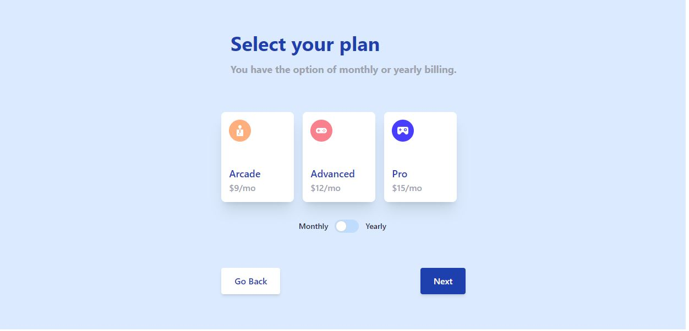

# Multi-Step Form

A interactive multi-step form design for purchasing a online service.

## How to Run
It is easy just go to: https://multi-form-shallon.netlify.app/

## Process

### Built with
- Semantic HTML5 Markup
- Tailwind CSS
- Vanillia JS

### Features
- Users can interact with 4 steps on the form.
    - Personal Info: This includes giving their name, email, and phone number.
    - Select a Plan: This includes choosing 1 of 3 offered plans at different monthly rates, they have the additional choose of it being monthly or yearly.
    - Add-ons: The user can include add-on at additional monthly or yearly fees.
    - Finialize: The user recieves a summary of their monthly or yearly payment based on seleected options. A breakdown of how the summary was calculated is also given.
- The user can add anytime go back and change previous options in the form without reloading the page in which the price of the summary will be dynamically updated.
- Tailwind CSS and JS DOM are utilized to ensure the form feels dynamic and is contained to one page.
- Visual cues are given to the user when infromations is filled out incorrectly.
- Mobile and Desktop Responsiveness.

### Author
- Website: https://shallonfpawlickpotts.netlify.app/#project
- Twitter: @shallondev

## Acknowledgements
This project was a challenge by Frontend Mentor. 